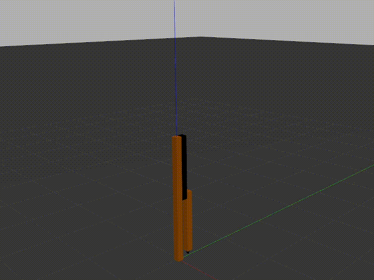
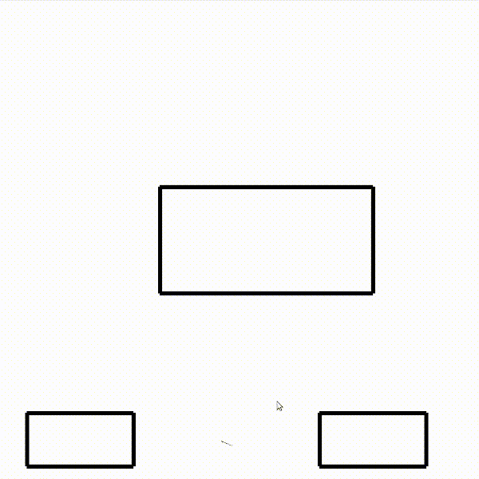
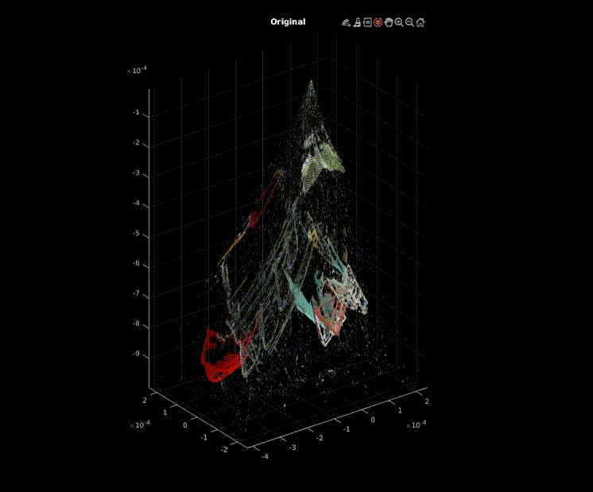
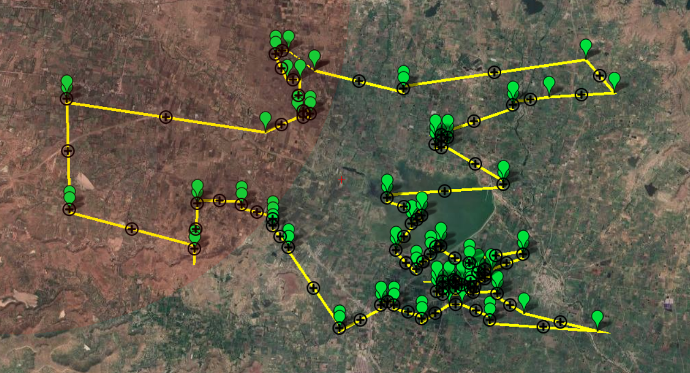

## Projects

### Robot Dynamics
  

Course Projects for RBE 501  
Mentor - Prof.  Nobuhiko Hata, PhD, Harvard Medical School

### Robot Control
  

Course Projects for RBE 502  
Mentor - Prof. Siavash Farzan, PhD Robotics, Georgia Institute of Technology

### Motion Planning

Course Projects for RBE 550  
Mentor - Prof. Daniel Montrallo Flickinger, PhD, The University of Texas at Arlington

### 3D Reconstruction
  

Course Project for RBE 549 - Computer Vision

### RecogSign
  

Multi-Stage Convolutional Neural Network based Traffic Sign Detection and Classification 

### AgriAir
  

Developing Shortest Path algorithms to build a Path Planning model for point-to-point optimization for UAVs.

***
[Home](./index.html)
